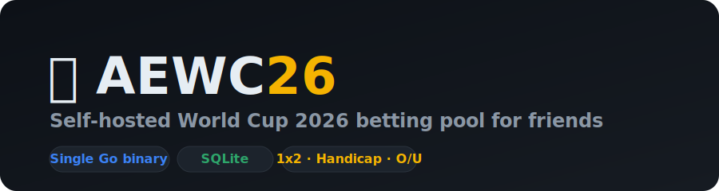

<div align="center">



# AEWC26 — friends' World Cup 2026 betting pool

**Self-hosted, peer-to-peer points betting for your group of friends.**
Run a private pool, place head-to-head bets with play-money points, and let the
results settle everything automatically. One Go binary, SQLite, no database
server, no signups for strangers.

[](https://github.com/vutuanphan/aewc26/actions/workflows/ci.yml)
[](LICENSE)
[](go.mod)

</div>

## What is this?

AEWC26 is a tiny self-hosted web app for betting **against each other** (not a
bookmaker) on World Cup 2026 matches, using points the admin hands out. One
person posts a wager on a match; a friend takes the opposite side for the same
stake; when the match ends, the pot is paid out automatically from the
full-time score. It ships with all 48 teams and 104 fixtures pre-loaded.

It is intentionally small and private: closed roster (the admin creates
accounts), no email required, login by username. Perfect for a group chat of
friends, a family, or an office.

## Features

- ⚔️ **Head-to-head betting** — creator stakes N points on one side, one taker
  matches N on the opposite side. Winner takes the pot.
- 🎲 **Three bet types** — 1x2 (win/draw/lose), **Asian handicap** (including
  quarter lines → half-win / push / half-loss), and over/under total goals.
- 🤖 **Automatic settlement** — results sync in and matched bets pay out with no
  manual work. Push/void refunds, un-taken bets refunded at kickoff.
- 👛 **Wallet + full ledger** — every grant, stake, refund and payout is
  recorded; each player has a transaction history page.
- 🏆 **Live leaderboard** by current balance.
- 💬 **Group chat** for trash talk.
- 📈 **Bookmaker reference odds** (optional, via [The Odds API](https://the-odds-api.com))
  shown right in the create-bet form for 1x2 / handicap / over-under.
- 🛠️ **Admin panel** — create players, reset passwords, grant/top-up points,
  enter or correct results.
- 🌐 **Bilingual** — English (default) + Vietnamese, switchable per device.
- 📱 Mobile-first dark UI.

## Screenshots

> _Add your screenshots to `docs/` and reference them here._

## Quick start

Requires Docker.

```sh
git clone https://github.com/vutuanphan/aewc26.git
cd aewc26
cp .env.example .env
# edit .env: set AEWC_ADMIN_PASSWORD (and ODDS_API_KEY if you have one)
docker compose up --build -d
```

Open `http://localhost:8091`, log in as **admin** with the password you set,
then go to **Admin → Players** to create accounts for your friends.

Want to try it instantly with sample players? Set `AEWC_SEED_DEMO=1` in `.env`
before the first run — it creates `demo1`…`demo4` (password `demo1234`).

### Run from source (no Docker)

```sh
go run .            # listens on :8090, DB at ./data/aewc.db (set AEWC_DB)
```

## Configuration

All configuration is via environment variables (see [.env.example](.env.example)):

| Variable | Default | Notes |
|---|---|---|
| `HOST_PORT` | `8091` | Host port (compose); app listens on 8090 inside. |
| `AEWC_BRAND` | `AEWC26` | Name shown across the UI. |
| `AEWC_START_BALANCE` | `100000` | Starting wallet for new players. |
| `AEWC_ADMIN_PASSWORD` | _(random)_ | Admin password; random + logged if unset. |
| `AEWC_SEED_DEMO` | `0` | `1` seeds 4 demo players (password `demo1234`). |
| `AEWC_TZ` | `Asia/Ho_Chi_Minh` | IANA timezone for kickoff display. |
| `AEWC_DB` | `/data/aewc.db` | SQLite path. |
| `ODDS_API_KEY` | _(empty)_ | The Odds API key — enables reference odds + result sync. |

## How settlement works

Bets settle on the **full-time (90') score**. The creator's net result is a
fraction in `{-1, -0.5, 0, 0.5, 1}`; the pot (`2 × stake`) is always fully
distributed:

| Bet type | Creator wins when |
|---|---|
| **1x2** | the chosen outcome (home / draw / away) happens |
| **Asian handicap** | `(backed goals − other goals) + line > 0` (quarter lines split across the two adjacent half-lines) |
| **Over/Under** | total goals beat the line on the chosen side |

The math lives in [`internal/app/betsmath.go`](internal/app/betsmath.go) and is
covered by [`betsmath_test.go`](internal/app/betsmath_test.go).

## Data & results

- Teams and fixtures are seeded from public-domain [openfootball](https://github.com/openfootball)
  data (`internal/app/seeddata/`).
- With an `ODDS_API_KEY`, results are pulled from The Odds API `/scores` and
  reference odds from `/odds`. Without a key, the admin enters results manually.

## Tech

Go 1.26 · `net/http` (stdlib router) · `html/template` server-rendered UI ·
pure-Go SQLite ([modernc.org/sqlite](https://modernc.org/sqlite), no CGO) ·
bcrypt sessions · vanilla JS. Everything (templates, static assets, seed data,
timezone DB) is embedded into a single static binary.

## Development

```sh
go vet ./...
go test ./...
go build .
```

See [CONTRIBUTING.md](CONTRIBUTING.md).

## Security

This is play-money among friends, but it still handles auth. See
[SECURITY.md](SECURITY.md). Highlights: bcrypt password hashing, server-side
sessions, CSRF double-submit tokens, parameterized SQL. Keep `.env` private and
put the app behind HTTPS (e.g. nginx/Caddy).

## Credits

- Fixtures: [openfootball](https://github.com/openfootball) (public domain)
- Odds & scores: [The Odds API](https://the-odds-api.com)

## License

[MIT](LICENSE) © Phan Vu Tuan
